<div align="center">
<picture>
  <source media="(prefers-color-scheme: dark)" srcset=".github/brand/banner-night.svg">
  
</picture>
<br><br>
<a href="#what-it-is"><picture><source media="(prefers-color-scheme: dark)" srcset=".github/brand/tab-what-it-is-night.svg"></picture></a>
</div>

<br>

<div align="center">

<br>

[](https://en.wikipedia.org/wiki/C_(programming_language))

</div>

<p>
<a name="what-it-is"></a>
<picture><source media="(prefers-color-scheme: dark)" srcset=".github/brand/section-what-it-is-night.svg"></picture>
</p>

A minimal Unix shell written in C — a classic "minishell" exercise. Reads a line, tokenizes it on whitespace, `fork()`s, and `execvp()`s the command in the child while the parent waits.

```sh
git clone https://github.com/NoamFav/Oh-My-Gosh && cd Oh-My-Gosh
make
./oh-my-gosh
```

> [!NOTE]
> This is a learning-exercise shell: single-command execution only, no pipes, redirection, or built-ins yet.

<div align="center">
Made with ♥ by <a href="https://github.com/NoamFav">NoamFav</a>
</div>

<br>

<a href="https://nf-software.com">
<picture>
  <source media="(prefers-color-scheme: dark)" srcset=".github/brand/footer-night.svg">
  
</picture>
</a>
